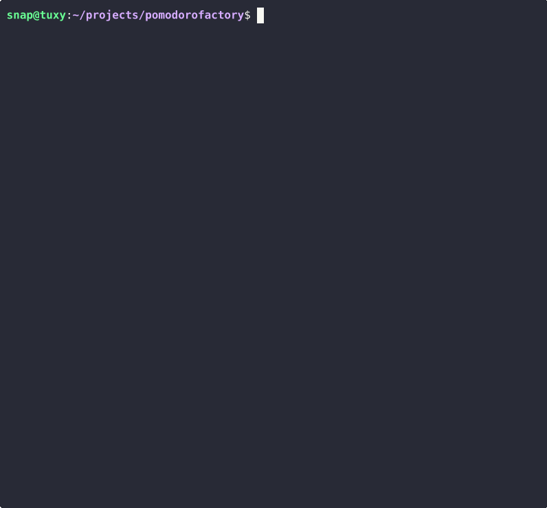

# 🏭 PomodoroFactory

> A pomodoro timer that actually builds something.



*(demo runs a 6-second pomodoro — in real life you get 25 minutes of crane action)*

Your focus powers a tiny terminal factory. Every 25 minutes, a crane welds together an ASCII art creation — complete with sparks, fanfare, and a gibberish congratulatory speech. Then you take a break and do it all again.

Five products ship by default. [Add your own](#add-your-own-product) — it's just a text file and a color map.

## What happens

1. Pick what to build (`←` / `→`)
2. Press `s` — the crane gets to work
3. Watch your thing get welded together, row by row
4. Timer ends → bell rings → press `c` to celebrate
5. Sparks fly, a fanfare plays, and the factory announces something like:
   > *"Spectacular! We brilliantly forged a legendary Penguin"*
6. Break starts automatically. Short (5 min) or long (15 min) every 4th pomodoro.
7. Repeat until done with life.

## What you can build

| | Product | |
|---|---|---|
| 🍅 | Tomato | the classic |
| ☕ | Coffee Cup | for the caffeinated |
| 🐧 | Penguin | a factory favorite |
| 🍊 | Orange | fresh |
| 🗼 | Eiffel Tower | ambitious |

## Install

```sh
go install github.com/anschnapp/pomodorofactory@latest
```

Or build from source:

```sh
git clone https://github.com/anschnapp/pomodorofactory
cd pomodorofactory
go build -o pomodorofactory .
./pomodorofactory
```

**Requirements:** Go 1.24+, a terminal with ANSI color support. Audio via `aplay` (Linux) or `afplay` (macOS) — optional, celebration works without it.

### Custom duration

```sh
./pomodorofactory 0.2   # 12-second pomodoro (for testing)
./pomodorofactory 50    # 50-minute deep work session
```

## Controls

| Key | Action |
|-----|--------|
| `←` `h` | Previous product (idle only) |
| `→` `l` | Next product (idle only) |
| `s` | Start pomodoro |
| `c` | Celebrate (when timer ends) |
| `q` / `Ctrl+C` | Quit |

## Add your own product

The factory can build anything. Adding a new product takes three steps:

**1. Draw your ASCII art** — create `pkg/product/art/yourhing.txt`:

```
    /\
   /  \
  / /\ \
 /_/  \_\
```

Keep it roughly within 23 columns × 10 rows (the current canvas size). Narrower and shorter is fine.

**2. Define a color scheme** — add a `makeYourthing()` function in `pkg/product/registry.go`:

```go
//go:embed art/yourthing.txt
var yourthingAsciiStr string

func makeYourthing() *Product {
    rows := iohelper.SplitMultilineStringToSlice(yourthingAsciiStr)
    colorMap := make(map[rune][]color.Attribute)
    colorMap['/'] = runecolor.MakeSingleColorAttributes(color.FgHiCyan)
    colorMap['\\'] = runecolor.MakeSingleColorAttributes(color.FgHiCyan)
    defaultColor := runecolor.MakeSingleColorAttributes(color.FgWhite)

    art := make([][]runecolor.ColoredRune, len(rows))
    for i, row := range rows {
        art[i] = runecolor.ConvertRunesToColoredRunes(row, colorMap, defaultColor)
    }
    return &Product{Name: "Your Thing", Emoji: "🏔️", Art: art}
}
```

For RGB colors: `[]color.Attribute{38, 2, R, G, B}` (foreground) or `[]color.Attribute{48, 2, R, G, B}` (background).

**3. Register it** — add it to the `All` slice in `init()`:

```go
All = []*Product{
    makeTomato(),
    makeCoffee(),
    makePenguin(),
    makeOrange(),
    makeEifenTower(),
    makeYourthing(), // <-- add here
}
```

Build and run — your thing is now in the factory rotation. PRs welcome.

## How it's built

No TUI framework. The rendering engine exploits Go's slice mechanics: a single master canvas is allocated, and each UI component gets a sub-region that shares the same backing array. Components write independently, their output lands directly in the final frame buffer. Zero copying, zero merging.

The audio is pure math — sine waves, sawtooth waves, and noise bursts generated in Go and piped to `aplay`/`afplay`. No audio files, no audio dependencies.

## License

MIT
